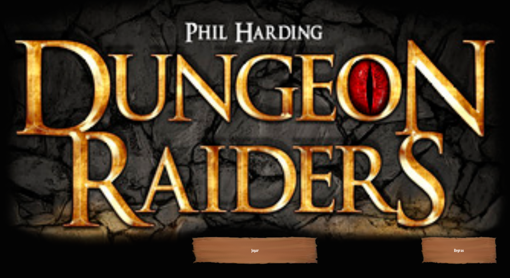
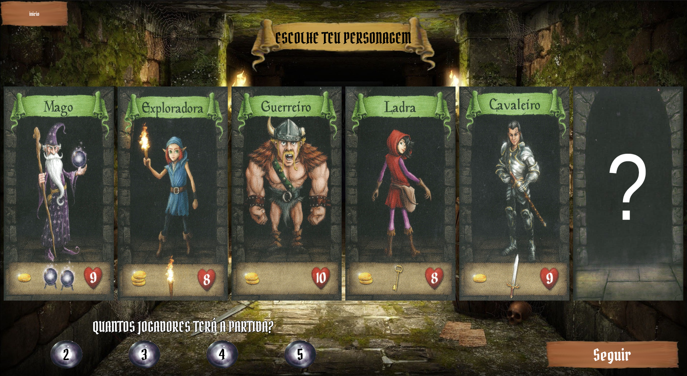
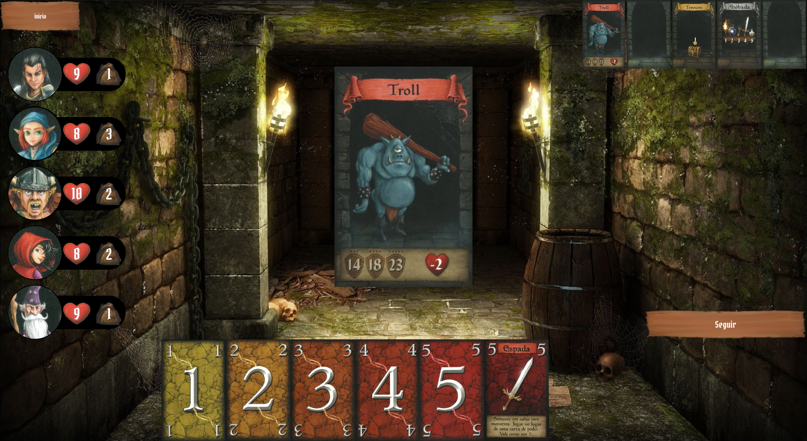

# Dungeon-Raiders
Jogo baseado na primeira edição do jogo Dungeon Raiders de Phill Harding, feito utilizando a interface grafica Kivy  
https://www.ludopedia.com.br/jogo/dungeon-raiders 
https://boardgamegeek.com/boardgame/80771/dungeon-raiders 
 

## capturas de tela
 
 
 
